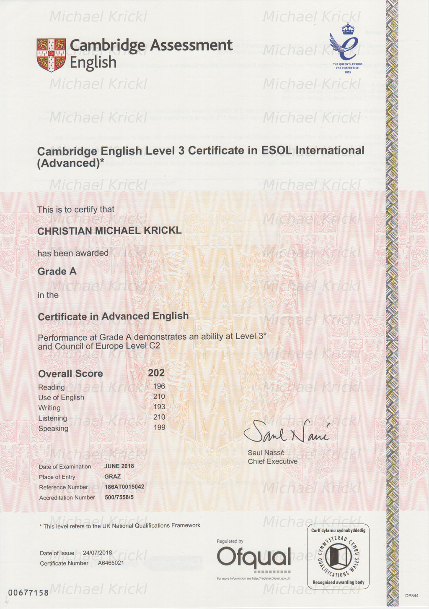

# certsafe
a simple script which watermarks, resizes, and converts images to JPGs and PDFs which are safe to share

## usage

```sh
$ ./certsafe WATERMARK IMAGE...
```

### example

```sh
$ ./certsafe watermark.png cae.png 
```



